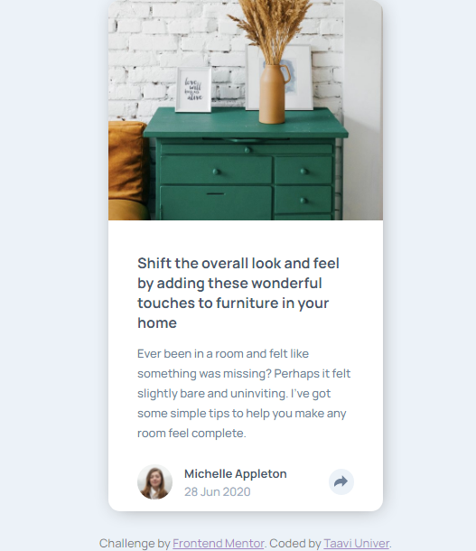
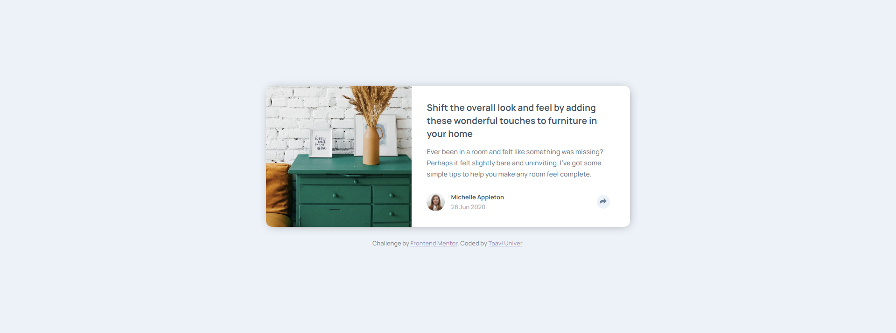

# Frontend Mentor - Article preview component solution

This is a solution to the [Article preview component challenge on Frontend Mentor](https://www.frontendmentor.io/challenges/article-preview-component-dYBN_pYFT). Frontend Mentor challenges help you improve your coding skills by building realistic projects. 

### The challenge

Users should be able to:

- View the optimal layout for the component depending on their device's screen size
- See the social media share links when they click the share icon

### Screenshot

Mobile view:

Desktop view:

### Links

- Solution URL: https://www.frontendmentor.io/solutions/article-preview-component-0bfjmrlm1
- Live Site URL: https://taavi-univer.github.io/article-preview-component/

## My process

### Built with

- Mobile-first workflow
- CSS Grid
- Flexbox
- Javascript

## Author

- Website - https://github.com/Taavi-Univer?tab=repositories
- Frontend Mentor - https://www.frontendmentor.io/profile/Taavi-Univer
